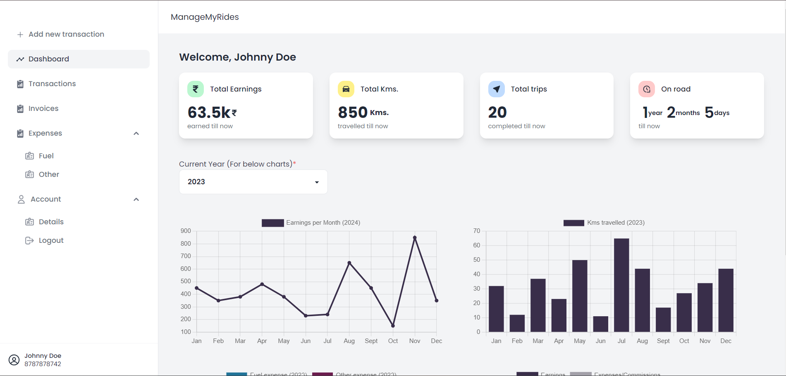
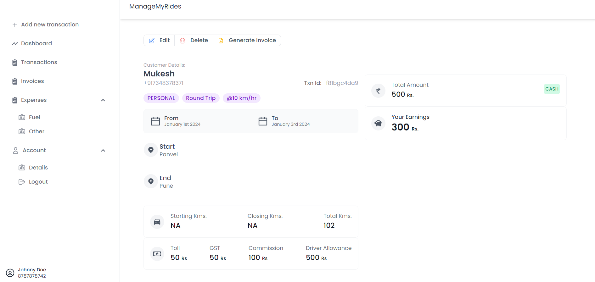
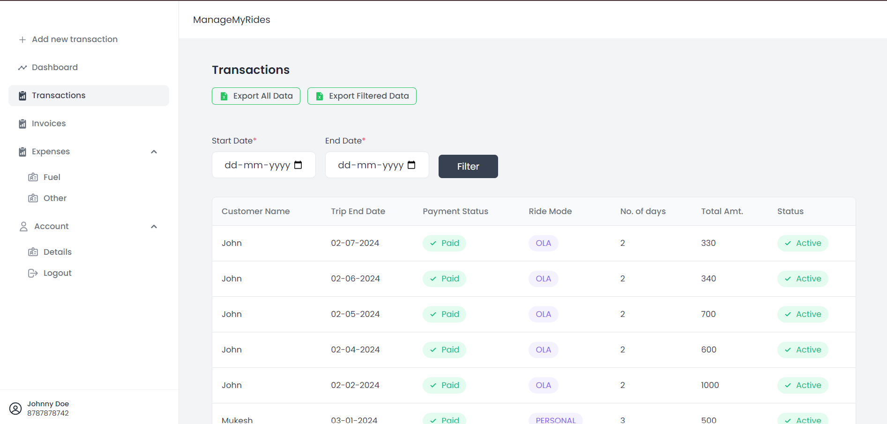
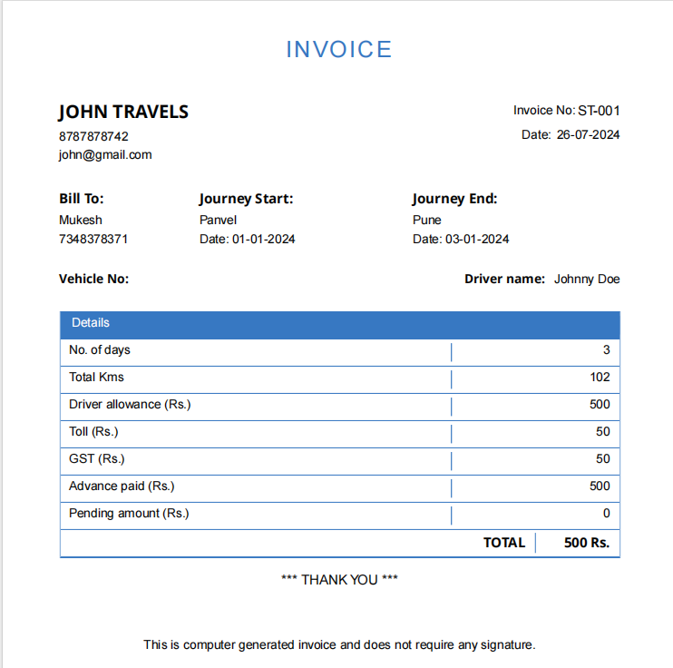

# ManageMyRides🚕

ManageMyRides is a web application that allows taxi drivers to keep track of their trips and generate invoices. 

  
  
   
   
   

Check live 👉 [here](https://rides-tracker.onrender.com/)
----------

--------------------

Features📃
--------

-   Built with **React JS** and **Tailwind CSS** for a responsive, modern, and user-friendly interface.
-   Utilizes **Express.js, Node.js, and MongoDB** to handle the server and database functionalities.
-   Provides detailed analytics and insights for all completed trips, including distance traveled, fare earned, and other relevant metrics.
-   Generates downloadable **PDF invoices** for each trip.
-   Enables users to export all trip data to an **Excel sheet** for further analysis and record-keeping.
-   Designed to be mobile-responsive and accessible across different devices, ensuring drivers can log their trips and generate invoices on the go.

Preview
--------

Trip details along with trip route visible using Google Maps

All transactions visible at one place which can be directly exported to an **Excel sheet**.

Sample Invoice

Credits
-------

-   The project is developed by Harsh Kunte and is inspired by the needs of taxi drivers to keep track of their trips and generate invoices.
-   The project is built using open-source libraries and frameworks, including React JS, Tailwind CSS, Express.js, Node.js and MongoDB.